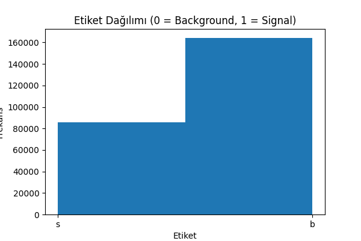

# Higgs Boson Classification

This project is designed to develop a simple **binary classification model** using the Higgs Boson dataset. In the **ATLAS experiment at CERN**, similar machine learning methods are used to analyze the massive amount of data from particle collisions. This project represents a **simplified example** of that process.

## Objective

- Load and explore the dataset  
- Clean missing values and scale features  
- Predict “signal” and “background” classes using Random Forest  
- Generate ROC Curve and Feature Importance plots  

## Technologies Used

- Python  
- Pandas  
- NumPy  
- scikit-learn  
- Matplotlib  

## Steps Taken

- Dataset downloaded and loaded into Python  
- Checked label distribution  
- Handled missing values and -999 placeholder values  
- Model training using Random Forest  
- Evaluated using Accuracy, Precision, Recall, and F1-score  
- Generated ROC Curve and Feature Importance plots  

## Visualizations

### Label Distribution

### ROC Curve

### Feature Importance

